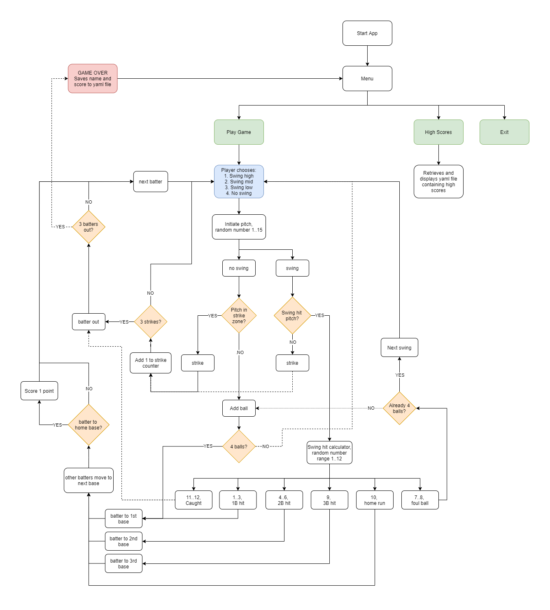

# **Batter up!**

# **T1A3 Terminal app - Justin Lee**

Github Repo: [https://github.com/JLee-WD/Batter-up](https://github.com/JLee-WD/Batter-up)

## **_Software Development Plan_**

## 1. Purpose & Scope

The terminal app I chose to develop is one that is based off classic baseball games I played when I was a kid. One of my earliest memories of playing video games was with my original brick gameboy playing baseball with mario and luigi. I aim to recreate those nostalgic gaming experiences into a terminal baseball game using Ruby. The purpose would be purely for entertainment and nostalgic value.

The app will simulate one baseball innings at-bat. Baseball rules apply, 3 strikes for an out, 4 balls for a walk and 3 outs to end the inning. After starting the app and selecting play. This will prompt the player to enter their name (for recording a high-score). The game will now start and the player as the batter will be able to select 4 actions in the strikezone, high swing, mid swing, low swing, or no swing. The app will randomly generate and visualize the pitch and provide feedback on the result. Depending on the swing, the outcome can either be a hit, strike, foul or a ball. If it is a hit, the type of hit outcome will be calculated to be either a 1-base hit, 2-base hit, 3-base hit, home run or foul ball. The baserunners will be visualized in a baseunning tracker on the scoreboard.

Just like real baseball, batter must strategize whether to go for hits to get on base quicker but risk striking out, or not swinging at all and walking batters on base. The game will end once there are 3 outs, and the goal will be to score as many home-runs as possible. High scores will be saved and displayed at the main menu.

The target audience for this app are baseball enthusiasts, gaming enthusiasts, or anyone who is knowledgable with coding or Ruby in particular. The app itself will also showcase my ability to create a working terminal game using ruby. The app will not solve any particular problem as it is a game created for entertainment purposes.

## 2. Features

### Batting System Feature

The first feature is the main component of the app, the batting system. This system includes randomly generating the pitch matching it against the chosen swing using ruby gem "Tty-prompt", and the hit chance outcome calculator. The batting system is located in the `main.rb file`. When the game starts, the game enters the first loop which breaks then the player's outs equal 3. The player selects an action from a prompt, swing high, mid, low or no-swing, and a random pitch is generated. The high swing holds the value as a range of the top of the strikezone, the mid swing holds the mid range of the strikezone, and the low swing holds the low range of the strikezone. If the generated pitch matches up with the chosen swing range, it becomes a hit. The hit is allocated a random integer, and the outcomes are represented as ranges. This way, the outcomes can be adjusted to raise or lower the chance of that outcome. For example, there is a higher chance of a 1 base or 2 base hit (`1..3, 4..6` respectively), and a low chance of a 3 base or home run hit (`3, 4` respectively). If the player chooses not to swing, the generated pitch can either be a strike or a ball. At this point, the outcome is saved in the PlayerBatter class. Once 3 outs are recorded the loop and thus the game, ends.

### PlayerBatter Class Feature

The second feature is the PlayerBatter class which stores the `@strikes`, `@balls`, `@outs`, `@home_runs` and `@bases` as instance variables. The class, which is located in `batter_class.rb` is instansiated when the player enters their name at the start of the game. The above instance variables are central to keeping track of the game's operation at any given time. The game itself is driven by the values of these variables. At the start of the game, all default values are `0` except for the name, which is a string, and the bases, which is an array. When a strike occurs in main.rb, the instance method `strike_count()` is called which adds 1 to `@strikes`, and checks if strikes equals 3. If so, it adds 1 to `@outs`, then resets balls and strikes back to 0 with the instance method `reset()`. If a hit occurs, the instance method `hit()` takes in one parameter and passes it through a case statement. Depending on the integer passed in from the hit (`1` for one base hit, `2` for two base hit etc.), the case statement will add the respective values to represent the baserunner position. For example, if the hit passes in a 2 base hit the method will `unshift(0,1)` to `@bases` array. If the hit passes in a 3 base hit the method will `unshift(0,0,1)` to `@bases` array and so forth. It then does a check, if `@bases` exceeds the length of 3, it enters a loop and adds the baserunners (which are have a value of 1) to `@home_runs` and removes them from the array. It will loop until `@bases` is less than 4. The last method in the class is `foul_or_ball()` which takes in one string as a parameter. If the string is `"foul"`, the method will check if `@balls` is less than 3, if so, it will add 1(This is because in baseball, a foul ball can't force a 4-ball walk). If the method passes the string `"ball"`, it will add 1 to `@balls`, then checks if `@balls` equals 4. If so, then it calls the `hit()` method to move the batter to first base. It then resets the strike and ball count with `reset()`. Finally, if both conditions are not met, the `else` outcome is a `puts` which states `"Foul Ball!"`.

### Scoreboard Feature

The third feature is the scoreboard located in `scoreboard.rb`. The scoreboard enhances user interaction by visually displaying the current counters of the game as easy-to-read strings in the terminal. The player will use this information to strategize their next action to move forward in the game. For example, if bases are loaded and there are 0 strikes, a smart player will swing. The scoreboard consists of the game title, counter tracker and baserunner tracker. The scoreboard itself is encompassed in a box, created by the ruby gem "Tty-box". The advantage of using this gem, is that all elements are contained with the box at a set width and height. The `scoreboard()` method takes in parameters `bases, home_runs, strikes, balls` and `outs`. It displays the `home_runs, strikes, balls` and `outs` into a counter tracker on the left side of the board, by simply passing the values into a large string encompassed by a box-frame. This string also holds the baserunner tracker on the far-right side of the scoreboard box. The baserunner tracker is visualized as a representation of the four bases. `@bases` array is passed in as parameter `bases`, which represents the position of the bases as an array of integers `1` or `0`, 1 being a baserunner, and 0 being no runner. If index 0 of `@bases` array has the value `1`, then the first base on the tracker is shown with an `x`. This is the same for index 1 (second base), and index 2 (third base). The method utilizes ternery's to assess the array's values. The last element of the scoreboard is simply the game's title "Batter-up!" shown using the ruby gem "Tty-font".

### Batter/Pitcher graphics feature

The fourth feature is the batter/pitcher visualization. The two methods that display the batter and pitcher are located in `swing.rb` and `no_swing.rb` and are named as such. If the player chooses to swing, the method `swing()` is called in `main.rb` with parameters `pitch`, `text` and `swing_index` passed in. The method will use the integer from `pitch`, validate it from a case statement which contains all the possible pitch locations, and changes the pitch location from an empty string `" "` to `"O"`. The method does a similar operation with the passed in `swing_index` to visualize the chosen swing. Both operations, plus the passed in `text` are shown in the batter/pitcher graphic, which is wrapped in a "Tty-box" set at the same width as the box for the scoreboard to keep the overall interface consistent. This method will visualize to the player, the pitch and swing along with a batter and pitcher figure in an easy to recognize interface.

### High Scores feature

The fifth feature is functionality of saving and retrieving high scores. Utilizing `yaml`, there are two methods inside `high_score.rb`. The first is `retrieve_high_scores()`. This method loads the `high_scores.yml` file containing an array of hashes of high score records. Each hash contains two key-value pairs. The first of which with of symbol `:name`, has the value as a string which was the players name. The second with the symbol `:score` has its value as an integer which was the players final score. The method retrieves this array and arranges the top 5 hashes (sorted by `:score`) into a table supplied by "tty-table". The second method is named `add_high_score()`. This method takes in two parameters, `name` and `home_runs` from the recent game. First, the method retrieves the `high_scores.yml` file and assigns it to a local variable named `high_scores`. A new hash is then created from the parameters `name` and `home_runs`. This new hash is inserted to the front of the `high_scores` array, which is then sorted through a while loop. The loop compares the `:score` of the first item of the array against the `:score` of the second item in the array. If the first item `:score` is less than the second item's `:score`, then it swaps their positions. The loop will check all items in the array and swaps the elements that are out of order. The array `high_scores` is now updated with the new hash and sorted in descending order. The method then saves this array to the `high_scores.yml`.

### Menu feature

The final feature is the animated menu. This feature is simple. Using the ruby gem "tty-font", the game title "Batter-Up!" is displayed in a box. This title is replicated 20 times into 20 different variables. For each variable in order, the title is reduced from the left at the same spacing. The variables are then printed in order, separated by `system("clear")` to clear the console, and `sleep(0.05)` to delay the reveal of each variable. This gives the effect that the title slides in from the left to the right when the game is loaded.

## 3. User interaction and Experience

The user will interact with the features in this app with the aid of ruby gem "Tty-prompt". Using prompt ensures navigating and using the app is very easy for users. Prompt is used at the main menu, when selecting `Play Game`, `High Scores` or `Exit`. The user will use their arrow keys to move up or down, and press enter to select the menu items. Similarly, during the game the player will select the swing with the same prompt. The UI is intentionally simple by design, options are clear easily recognizable.

Depending on the action chosen by the player, the control flow established by the batting system calls the appropriate methods in the PlayerBatter instance class. For example, if the player selects a swing and registers a hit, a hit chance calculation takes place. If a hit is successful, the instance method `hit()` is called and takes the relevant action or adds to the appropriate counters. This information is saved in instance variables, and shown to the user in the interface via the scoreboard feature. For feedback, the graphic of the pitcher, batter change stances. The pitch and swing is also visualized. All of these features are designed to follow the game logic with very little input from the player. These features are also visualized via the graphic interface and scoreboard.

The graphic interface shown when the user is selecting a swing provides figures drawn in ascii to indicate the batter and pitcher. Both have stances that are in pre-pitch and pre-swing. The strikezone, scoreboard, and baserunning trackers are also shown. When the user chooses a swing several things happen, the batter and pitcher's stances change, the pitch location is shown, the swing is shown, and text pops up showing the result. This is all (almost) real-time visual feedback to the player. The scoreboard and baserunning tracker will update with their result providing feedback of their progress.

Using prompt removes unknown input from the user, thus removing errors stemming from user input. The only time when the user is asked to input data is the prompt for their name. For this input, an error handling method named `name_error` located in `error_handling.rb`, checks if the value of the name input is nil. If so, the method will throw an arguement error and print to the console `"Name must not be empty"`. If the user only inputs white spaces, then the method will strip the white space and check if the name is empty, if so, it will throw an error. The purpose of this, is so that when a new record is added to the high scores yaml file, the `:name` value is not empty. Error handling is also implemented in main.rb when the referenced files are located. If a file is unable to load, the program will print `"Unable to load referenced file from main.rb"` and exit.

## 4. Control Flow Diagram

Batting System Control Flow Diagram

## 5. Implementation Plan

Link to Trello board: [https://trello.com/b/5zppmCiL/batter-up](https://trello.com/b/5zppmCiL/batter-up)

I have used Trello as my project management platform to aid implementation. MVP features are prefixed with MVP before the title for each card. I have separated the cards in the following catagories; Design, MVP to do, Documentation to do, Doing, Done, Deadlines, Testing, and Extra Features. Each MVP card is further broken down into a checklist. Each checklist item is a task required to be completed within the hours allocated.

Priority MVP (Minimal Viable Product) features are listed below:

1. Batting system
   
1. Batter Class
   
1. Basic graphic interface
   
1. High scores feature
   
1. Menu
   
1. Scoreboard including Baserunning Tracker
   
1. Ruby gems: Bundler, Tty-prompt, Tty-box, Tty-font, Colorize, Minitest
   

Extra features to be implemented at a later time:

1. Additional graphic animations
1. More in-depth hit-chance batting system
1. Pitching system
1. Expanding game length to 9 innings
1. Implement batter skill to affect hit rates
1. Implement pitcher skill to affect chances of strikes

## 6. Installation

1. First you will need Ruby installed to run Batter-up! Find out how to install ruby from the following link:

   [Install Ruby](https://www.ruby-lang.org/en/downloads/)

1. Clone from the Github repo using the command:

   `git clone (repo link)`: [Batter-Up! Github Repo](https://github.com/JLee-WD/Batter-up)

1. Navigate to the `src` folder of the repo using your terminal,

   `cd JustinLee_t1a3` then `cd src`

1. Next, install Ruby gem Bundler. Install bundler by entering the following command in your terminal:

   `gem install bundler`.

1. Finally, simply run the following command in your terminal to execute the app:

   `./run_app.sh`

   This will install all required gems and run Batter-Up!. Ruby Gems required:

   1. Bundler - used to bundle and manage ruby gems
   1. TTY-font - used for the main title font & scoreboard title font
   1. TTY-box - used to frame the main menu, the scoreboard, and the main graphic interface
   1. TTY-prompt - used for the main menu, and for the action selection for the batting system
   1. TTY-table - used to format the high scores into a table
   1. Colorize - used for string colouring
   1. Minitest - used for tests

## 7. Testing

Using Minitest, I have created 5 unit tests in the file `tests.rb` to assess the output & function of the methods in the PlayerBatter class instances and the high score yaml retrieval method.

For example, the `hit()` method located in an instance of PlayerBatter class is tested for correctly pushing values to the `bases` array. It is then tested if it correctly adds home runs when a value reaches the 4th index.

After running the tests, 5 runs and 14 assertions result in 0 failures, 0 errors and 0 skips.
